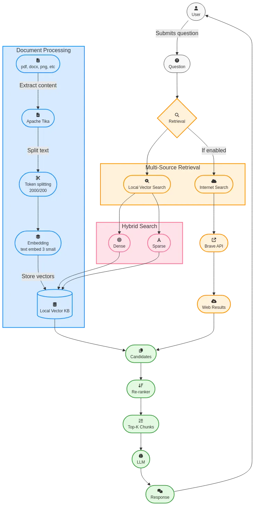

# Multi-Source-RAG-Assistant-For-Students
On this particular project i will try to make a RAG pipeline in order to extract data from different data sources (e.g pdfs, word, vectordb, NoSQL etc) and get better answers without halluscinating from an LLM. 

# Architecture

An intelligent document retrieval and question-answering system built with modern AI technologies. Students can upload multiple data sources (PDFs, CSVs, databases) and ask natural language questions to receive accurate answers with source citations.

🎯 Key Features

📚 Multi-Source Data Integration

PDF Upload: Extract text from research papers, textbooks, and documents
CSV Support: Import structured data from spreadsheets
Database Connectivity: Connect to PostgreSQL for metadata storage
Vector Storage: Qdrant for fast similarity search

🔍 Hybrid Information Retrieval

BM25 Search: Keyword-based lexical matching for precise term matching
Dense Retrieval: Neural embeddings for semantic understanding
Reciprocal Rank Fusion: Combines both strategies for optimal results
Smart Reranking: Re-scores results for relevance

🤖 Local & Cloud LLM Support

Ollama: Run open-source models locally (Mistral, Phi, Neural-Chat)
OpenAI API: Optional integration for GPT-4 (paid)
No Vendor Lock-in: Switch between providers seamlessly

💾 Persistent Data Management

PostgreSQL: Stores document metadata, user data, chat history
Redis: Caches embeddings for faster retrieval
Qdrant: Efficient vector database with 10M+ vector support

📄 Document Processing

Apache Tika: Extracts text from PDFs, Office documents, images
Smart Chunking: Splits documents into optimal 500-token chunks
Metadata Preservation: Tracks source, page numbers, timestamps

🎯 Citation & Transparency

Source Attribution: Every answer includes references to source documents
Relevance Scores: Shows confidence in retrieved information
Transparency: Users know exactly which documents contributed to answers